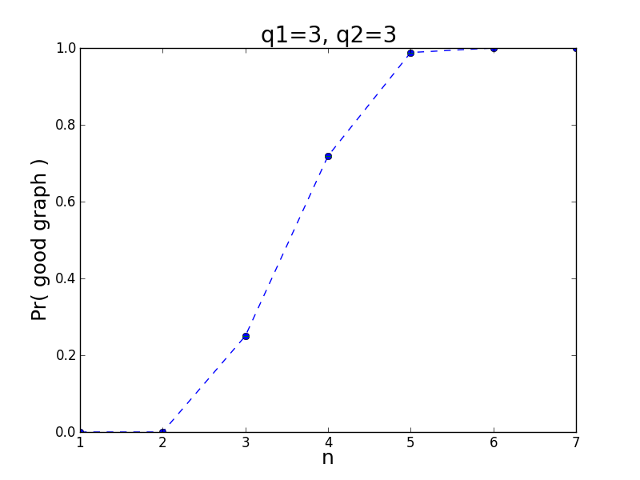
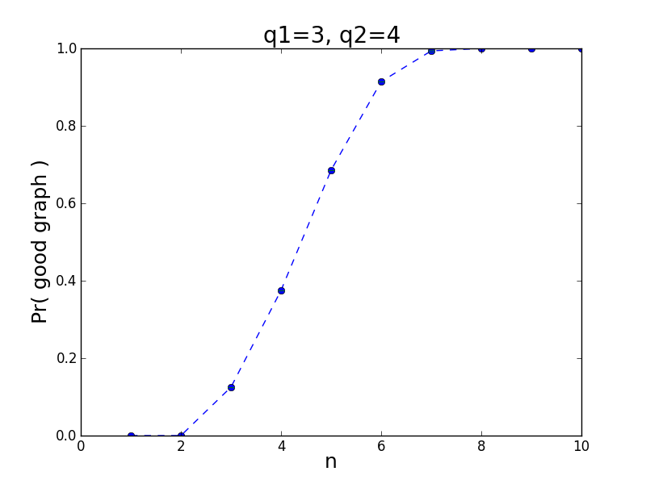
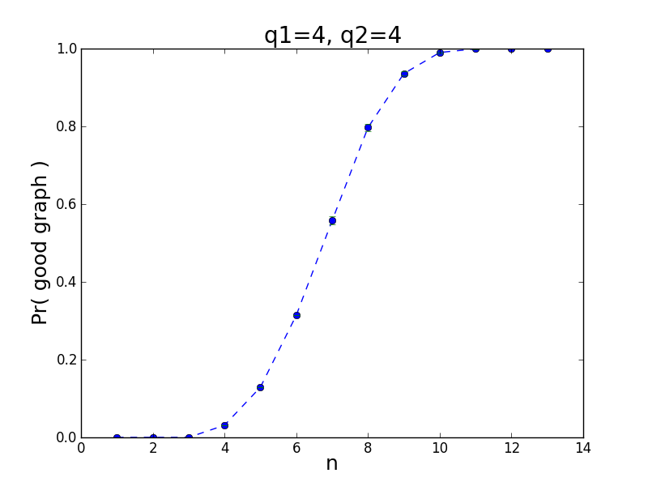

# RamDist

Terminology: Given n, q1, q2 
define a ***good*** graph as one that has either a sub-clique of size q1 (call this a Kq1) *or* a sub-independent-set of size q2 (call this an Iq2).  A ***bad*** graph has neither substructure.

RamDist calculates the proportion of good graphs of size n, as n increases from 1 to the [Ramsey number](https://en.wikipedia.org/wiki/Ramsey's_theorem#Ramsey_numbers) R(q1,q2). Let's illustrate with figures:

When the graph size n <= 2, 0% of the graphs are good. This is because the graph is too small to have a Kq1 or an Iq2.

When the graph size n >= R(q1,q2), 100% of the graphs are good.  Since R(3,3)=6, 100% of the graphs of size >= 6 are good.

Let's step up to bigger results:

  

  

## Method
There are 2^(n*(n-1)/2) graphs of size n.  When n is small, say < 7, we can enumerate every graph of size n and count how many are good.

When n is large, say >= 7, enumerating every graph of size n is infeasible.  Instead, generate m random graphs of size n and count how many are good.  Use this to estimate the true proportion of good graphs. A typical value for m is 15000.

Currently I use the Erdos-Renyi, where all edges are present with probability p=0.5 independently, to generate random graphs.  It is well-known that Erdos-Renyi random graphs are not indicative of real-world networks.  It is worthwhile experimenting with other random graph models in the future.  

Along with the estimates in the n large case, I calculate 99% confidence intervals taking the sample size into account.  The confidence intervals are shown in the graph as red error bars, but the error is so small that you can hardly see the red below the blue marks.  NOTE: I am unsure of the validity of confidence intervals here; they require I use a simple random sample on a large population of graphs. Does sampling Erdos-Renyi graphs with replacement count? Will think about it further...

Next steps: analyze results for q1=5,q2=5. Use larger sample sizes.  Consider parallelizing code.

### Thanks
to the [igraph](http://igraph.sourceforge.net/index.html) library! Your clique number and independent set number and random graph generation methods really helped.

<!-- MathJAX Latex Support -->

