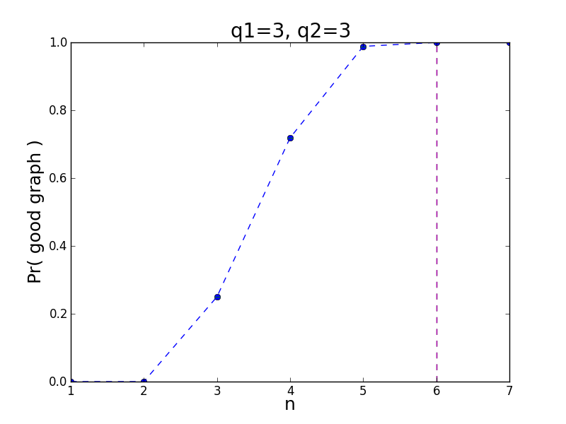
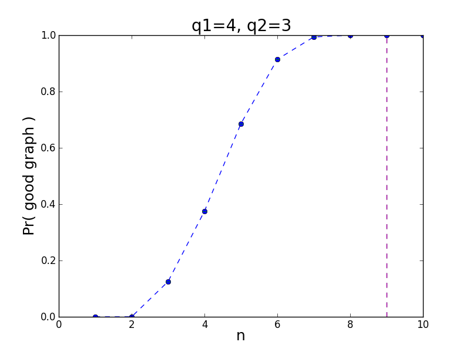
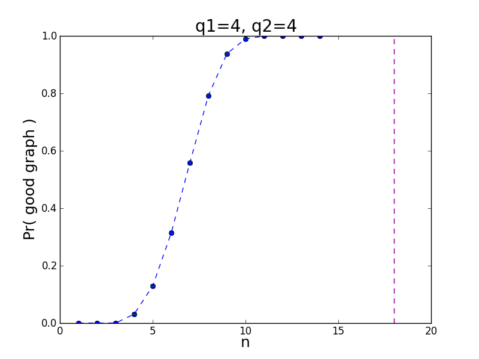
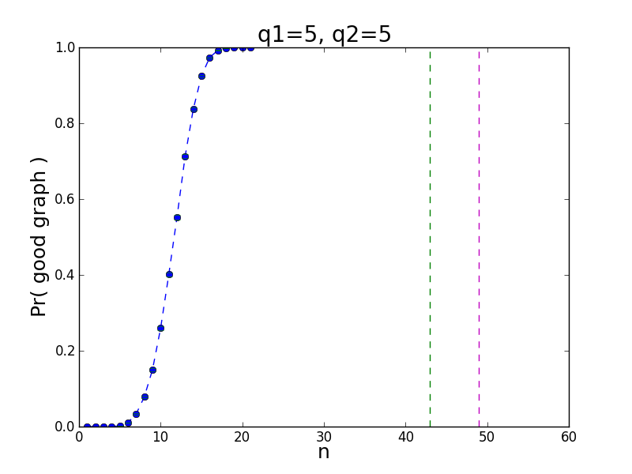
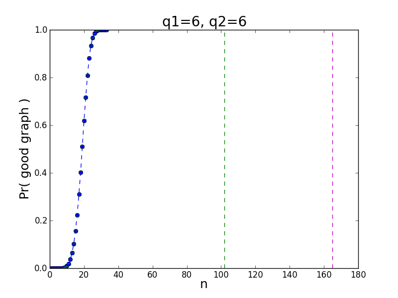

# RamDist

Terminology: Given n, q1, q2 
define a ***good*** graph as one that has either a sub-clique of size q1 (call this a Kq1) *or* a sub-independent-set of size q2 (call this an Iq2).  A ***bad*** graph has neither sub-structure.

RamDist calculates the proportion of good graphs of size n, as n increases from 1 to the [Ramsey number](https://en.wikipedia.org/wiki/Ramsey's_theorem#Ramsey_numbers) R(q1,q2). Let's illustrate with figures:

When the graph size n <= 2, 0% of the graphs are good. This is because the graph is too small to have a Kq1 or an Iq2.

When the graph size n >= R(q1,q2), 100% of the graphs are good.  Since R(3,3)=6, 100% of the graphs of size >= 6 are good.

Let's step up to bigger results. Note that the vertical lines represent [known lower (**green**) and upper (**magenta**) bounds](https://en.wikipedia.org/w/index.php?title=Ramsey%27s_theorem&oldid=585236006#Ramsey_numbers) on the Ramsey number R(q1,q2).  There is only one vertical line if the Ramsey number is known exactly.

  

  

### Approximate Ramsey Numbers
Given q1, q2 and c (say c=0.9), let's calculate the smallest size n such that at least c of the graphs of size n are good. Call this **c-R(q1,q2), the c-approximate Ramsey number**. We can find these easily from the graph-- just choose the smallest n that plots above c.

Here is a table of the 0.99-approximate Ramsey numbers, varying q1 and q2:

| q1 \ q2 | 3 | 4  | 5  | 6  |
|---------|---|----|----|----|
| 3       | 6 |    |    |    |
| 4       | 7 | 11 |    |    |
| 5       | 8 | 13 | 17 |    |
| 6       | 9 | 14 | 21 | 27 |

Notice that 0.99-R(q1,q2) << R(q1,q2).  Here is the fraction dividing 0.99-R(q1,q2) / R(q1,q2):

| q1 \ q2 | 3    | 4    | 5    | 6    |
|---------|------|------|------|------|
| 3       | 1.00 |      |      |      |
| 4       | 0.78 | 0.61 |      |      |
| 5       | 0.57 | 0.52 | 0.40 |      |
| 6       | 0.50 | 0.39 | 0.36 | 0.26 |

Interesting result. What are the applications & corollaries?

## Method
There are 2^(n*(n-1)/2) graphs of size n.  When n is small, say < 7, we can enumerate every graph of size n and count how many are good.

When n is large, say >= 7, enumerating every graph of size n is infeasible.  Instead, generate m random graphs of size n and count how many are good.  Use this to estimate the true proportion of good graphs. A typical value for m is 50000.

Currently I use the Erdos-Renyi, where all edges are present with probability p=0.5 independently, to generate random graphs.  It is well-known that Erdos-Renyi random graphs are not indicative of real-world networks.  It is worthwhile experimenting with other random graph models in the future.  

Along with the estimates in the n large case, I calculate 99% confidence intervals taking the sample size into account.  The confidence intervals are shown in the graph as red error bars, but the error is so small that you can hardly see the red below the blue marks.  NOTE: I am unsure of the validity of confidence intervals here; they require I use a simple random sample on a large population of graphs. Does sampling Erdos-Renyi graphs with replacement count? Will think about it further...

### Evidence for p=0.5 in Erdos-Renyi random graphs
To validate my choice of p=0.5, I compared it to two alternative schemes:

1. Sample p from a Beta(1.5,1.5) distribution.
2. Sample p from a Uniform[0,1] distribution.

I compared those alternatives, along with always using p=0.5, to the true proportion of good graphs for n=6 and various q1, q2.  I used a sample size of 10000 random graphs out of a population of 2^(6 choose 2) = 32768 graphs.

| n | q1 | q2 | truep  | p_50   | randomp_beta1515 | random_uniform |
|---|----|----|--------|--------|------------------|----------------|
| 6 | 4  | 3  | 0.9142 | 0.9182 | 0.9430           | 0.9542         |
| 6 | 4  | 4  | 0.3138 | 0.3188 | 0.6493           | 0.7140         |
| 6 | 5  | 3  | 0.8286 | 0.8297 | 0.7855           | 0.8038         |
| 6 | 5  | 4  | 0.1622 | 0.1616 | 0.4506           | 0.5250         |
| 6 | 5  | 5  | 0.0105 | 0.0098 | 0.2547           | 0.3356         |

As you can see, always choosing p=0.5 is closest to the true proportion truep.   

## Analysis
If the results are correct (valid simple random sample, valid confidence intervals), then 99% of all graphs of size n are good graphs when n is far smaller than the Ramsey number R(q1,q2).  This means we can, with high probability, *guarantee the presence of certain sub-structures in networks much smaller than expected by the Ramsey numbers*.  By sub-structure I mean cliques and independent sets, but I believe the results can generalize to other opposing sub-structures.

### Next steps
Check other random graph models. Use larger sample sizes.  Consider parallelizing code.  Find the asymptotic trend of n at which 99% of all graphs are good.

## Thanks
to the [igraph](http://igraph.sourceforge.net/index.html) library! Your clique number and independent set number and random graph generation methods saved quite a bit of time.

